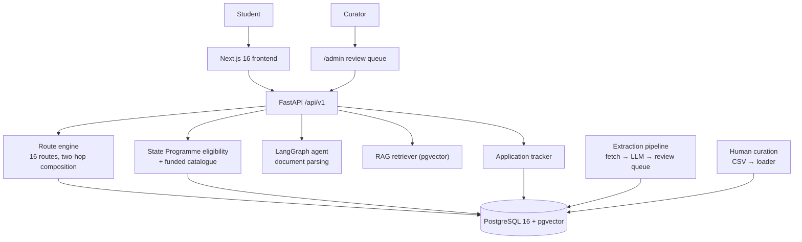

# AUSA — AI University & Scholarship Advisor

[](https://github.com/Ali0lo/AUSA/actions/workflows/ci.yml)
[](https://fastapi.tiangolo.com)
[](https://nextjs.org)
[](https://github.com/pgvector/pgvector)

---

## What this is

**AUSA** answers one question for an Azerbaijani student: **where can you actually go, and who pays?**

Not "which university is a 87% match for you." That number cannot be honestly computed, and the
project removed every place it used to appear. What AUSA computes instead is a **route**: the path
from the qualification you hold today to a seat in a foreign university, with the requirement that
blocks it, the months it takes, and the cost in manat.

The finding the product is built around is this:

> An Azerbaijani school-leaver holding an **attestat cannot apply directly to Germany or the UK**.
> Both are closed. **One year at an Azerbaijani university opens both**, because it converts the
> attestat into a qualification those systems recognise.
>
> That single fact reorganises a student's whole plan, and it is exactly the fact a commission-paid
> agency has no incentive to lead with.

Scope is **studying abroad**: Turkey, Germany, the United Kingdom, the USA, Poland, and China.
Azerbaijani universities appear in exactly one role — the prep year that unlocks the others.

---

## The two ideas worth reading the code for

### 1. A route is data, not a branch

`AZ_PREP_YEAR` is an ordinary route like any other. Germany and the UK unlock after it *not*
because of an `if` statement, but because `QUALIFICATION_ONE_YEAR_UNIVERSITY` appears in their
`requires_qualification` tuples. Routes compose to a **two-hop cap**, so
`az-prep-year → de-bachelor-direct` falls out of the data rather than being special-cased.

Adding a country means adding rows to `backend/app/domain/route_definitions.py`. It does not mean
touching the engine.

### 2. An unknown must never read as permission

This is [ADR-0004](docs/adr/0004-batch-serving-and-explainability.md), and it is enforced by tests
rather than by good intentions. A `NULL` requirement means *"nobody has checked"* — never
*"not required."* Concretely, in this codebase:

| Question | What AUSA answers | What it used to answer |
|---|---|---|
| Chance of admission? | `null`, with the reason | a formula's invented percentage |
| Application deadline? | "I do not have a verified deadline" | `November 30, 2026`, for every programme |
| Unreadable transcript? | "nothing was changed on your profile" | GPA 3.8, IELTS 7.5 |
| Requirements for this programme? | "unknown — not yet curated" | a plausible-looking guess |

Every one of those blanks is a **labelled absence**. The product's competitive claim is that it is
the only tool in this market that says *I don't know* out loud.

---

## Run the demo (no database, no API key, ~10 seconds)

The fastest way to see what the project actually does:

```bash
python -m venv .venv
.venv\Scripts\activate          # Windows
source .venv/bin/activate       # macOS / Linux
pip install -r backend/requirements.txt

python demo_walkthrough.py
```

It runs the **real FastAPI application** in-process against SQLite, seeded from the **real State
Programme CSVs**. For a Baku school-leaver with an attestat, DİM 520, IELTS 7.0 and C1 German it
prints: the open routes, the blocked ones with the requirement that failed, the two-hop plan that
reaches Germany, State Programme eligibility, the funded programmes actually reachable — and a
closing section listing what it refuses to answer.

---

## Architecture



### Components

| Layer | Module | What it does |
|---|---|---|
| Route engine | `app/services/route_engine.py` | Classifies each route OPEN / UNLOCKABLE / BLOCKED, composes two-hop plans |
| Route data | `app/domain/route_definitions.py` | 16 routes across 6 countries, each with cited requirements, months and AZN cost bands |
| State Programme | `app/services/dp_eligibility.py` | Band check, gate list, and a four-way explanation of *why* a funded list is empty |
| Catalogue | `app/models/dp_catalogue.py` | 4,121 official 2026 funded programmes |
| Requirements | `app/models/qualifications.py` | What each university asks of an international applicant |
| Extraction | `app/data_pipeline/` | Fetch → structured LLM extraction → review queue. Fails loudly; never substitutes |
| Agent | `app/services/agent/` | LangGraph document parsing and profile extraction |
| RAG | `app/services/rag/` | pgvector retrieval with grounded generation |

### Stack

**Backend** FastAPI · Pydantic v2 · SQLAlchemy 2.0 async · Alembic · PostgreSQL 16 + pgvector
**AI** LangChain · LangGraph · OpenAI gpt-4o-mini · scikit-learn · joblib
**Frontend** Next.js 16 App Router · TypeScript · Tailwind · NextAuth
**Ops** Docker Compose · GitHub Actions

---

## Data, and where each number comes from

Every row in this project carries a provenance state. Nothing is shown to a student without one.

| State | Meaning | How a row gets it |
|---|---|---|
| `seed` | Bulk-loaded from an official published catalogue | `scripts/load_dp_catalogue.py` |
| `claude-extracted` | An LLM read it off an official page | `data_pipeline/jobs.py` — **always this, never higher** |
| `human-verified` | A person opened the source page and confirmed it | a curator in `/admin`; `verified_by` records who |

An LLM's confidence in its own extraction is **not** evidence. A high confidence score makes a row
wait less long for review; it can never promote one.

| Dataset | Rows | Status |
|---|---|---|
| State Programme 2026 catalogue | 4,121 (2,293 in target countries) | Official CSVs, current |
| Turkey YÖK placement history | 29,293 programmes | Powers the TR cutoff model |
| Azerbaijan DİM cutoff history | 2,576 rows / 1,028 programmes | Idempotent loader with a collision guard |
| Programme requirements | in curation | The critical path — see `data/curation/README.md` |

**Bachelor places are not evenly spread.** From the official 2026 catalogue: China funds 307
bachelor places, the UK 161, Turkey 106, Germany 27 — and the **USA and Poland fund none at all**.
Curation is prioritised accordingly.

---

## Machine learning

One model family, one honest claim. Cutoff prediction applies **only where admission is
mechanical** — a published score threshold the student is measured against. Where admission is
committee-decided, AUSA publishes no probability at all
([ADR-0008](docs/adr/0008-selectivity-replaces-cutoff-prediction.md)).

| Country | Baseline (department mean) | Model (HistGradientBoosting) | Improvement |
|---|---|---|---|
| Turkey | 38.96 MAE | **17.96** | 54% |
| Azerbaijan | 57.37 MAE | **41.34** | 28% |
| USA | 112.76 MAE | 95.52 | 15% — too weak to ship |

Reproduce with `backend/scripts/train_cutoff_models.py`; full metrics in `models/metrics.json`,
which is committed so any predicted number is traceable to the run that produced it.

> **Currently these models are analysis artifacts, not a serving path.** No endpoint loads them.
> The previous in-process predictor was deleted because it computed a percentage from a hardcoded
> formula whenever the model files were absent — which, since they are gitignored, was every fresh
> clone.

---

## Setup

```bash
git clone https://github.com/Ali0lo/AUSA.git && cd AUSA
cp backend/.env.example backend/.env
cp frontend/.env.example frontend/.env.local

docker-compose -f docker-compose.prod.yml up -d --build
PYTHONPATH=backend python -m scripts.seed_db          # baseline fixtures
PYTHONPATH=backend python -m scripts.load_dp_catalogue  # official DP catalogue

cd frontend && npm install && npm run dev
```

Backend `http://localhost:8000/api/v1` · frontend `http://localhost:3000`
`OPENAI_API_KEY` is required for RAG, the agent, and LLM extraction. Without it those paths return
a clear error rather than degraded output.

### Tests

```bash
cd backend && python -m pytest -q      # 186 tests
cd frontend && npm run build           # type check + production build
```

---

## Crawling policy

Sources are read only where the site permits it, and the decisions are recorded rather than
assumed:

- **qebulai.az — excluded.** Its `robots.txt` disallows ClaudeBot, GPTBot and CCBot, it sets
  `Content-Signal: ai-train=no`, and it reserves rights under Article 4 of EU Directive 2019/790.
- **hochschulstart.de** disallows `/fileadmin/`, where its statistics PDFs live. Not crawled.
- **DAAD** sets `Crawl-delay: 2` and disallows its scholarship database.
- **Aggregators** (`nc-werte.info`, `studis-online.de`, `auswahlgrenzen.de`, CUCAS) are used only
  to *discover* official URLs, never as sources.

---

## Documentation

| Document | Contents |
|---|---|
| [`docs/adr/`](docs/adr/) | 8 architecture decisions, including the two that shaped the product: [0006 admission routes](docs/adr/0006-admission-routes.md) and [0008 selectivity replaces cutoff prediction](docs/adr/0008-selectivity-replaces-cutoff-prediction.md) |
| [`docs/superpowers/specs/`](docs/superpowers/specs/) | The route-first design spec |
| [`docs/open-questions.md`](docs/open-questions.md) | What is still unresolved, with owners |
| [`data/curation/README.md`](data/curation/README.md) | The curation worklist, ranked by coverage |

---

## Honest status

**Working end to end:** route engine and two-hop composition · State Programme eligibility and the
funded catalogue · `POST /routes/assess`, which now answers with the **named universities** each
plan reaches and what each one asks · curated requirements for 12 universities across DE, GB, TR
and CN · auth and access control · application tracker · admin review queue · PDF export ·
233 passing tests.

**Built but not yet connected:** the frontend still shows demo programmes rather than calling the
route engine · the agent's tools cannot see routes or the catalogue · the RAG store holds no
curated university documents · the cutoff models have no serving path.

**Not built:** per-programme deadlines · motivation-letter generation · application submission,
which is deliberately out of scope and always will be.

### How a plan finds its universities

`Route` and `ProgramRequirement` speak the same vocabulary — the `QUALIFICATION_*` constants — so
the join needs no mapping table between them. A plan delivers whatever qualification its last
*producing* hop produces, and a university's row names the one qualification it accepts:

| plan | delivers | universities it reaches |
|---|---|---|
| `tr-bachelor-direct` | `attestat` | Istanbul Technical, Boğaziçi |
| `de-bachelor-studienkolleg` | `feststellungspruefung` | TUM, Heidelberg, LMU |
| `uk-bachelor-foundation` | `foundation_year` | UCL, Edinburgh, Manchester |
| `az-prep-year` → `uk-bachelor-direct` | `one_year_university` | **Manchester, Cambridge** |

The last row is the product's claim, resolved to two named universities whose own admissions pages
say so. Note that the two UK plans end at the same hop in the same country and reach **different**
universities — anything keyed on the destination alone cannot tell them apart.

An empty list is never left to speak for itself. `universities_status` distinguishes *we have not
collected that country yet* (a gap in our data) from *we collected it and none of those universities
documents this qualification* (a finding about the country). And every `NULL` requirement is named
in `unknown_fields` rather than rendered as a blank, because a blank tuition reads as free and a
blank language test reads as none required — both wrong in the direction that costs an application.

---

## Team

Four contributors. This repository does not currently include a LICENSE file.
