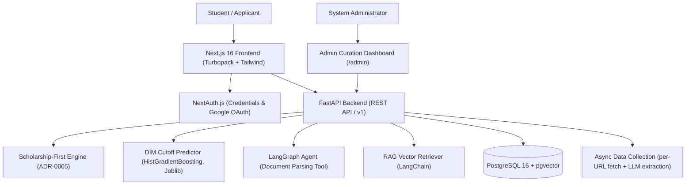

# AUSA — AI-Powered University & Scholarship Advisor

[](https://github.com/Ali0lo/AUSA/actions/workflows/ci.yml)
[](https://fastapi.tiangolo.com)
[](https://nextjs.org)
[](https://github.com/pgvector/pgvector)
[](https://www.docker.com)

---

## 📌 Project Overview

**AUSA (AI University & Scholarship Advisor)** is an intelligent advisory and university matching platform created as a **Holberton School Final Project**. It specifically bridges Azerbaijani students with top international (Germany, US, Turkey) and local Azerbaijani higher education institutions (ADA University, UNEC, Baku Higher Oil School, Baku State University).

By combining deterministic decision-tree logic, predictive machine learning models, vector retrieval (RAG), stateful LangGraph agents, and automated data pipelines, AUSA provides a transparent, scholarship-first matching engine for prospective university applicants.

---

## ✨ Key Features

- 🎓 **Scholarship-First Net-Cost Evaluation ([ADR-0005](docs/adr/0005-scholarship-pass-precedes-budget-filter.md))**: Evaluates eligible institutional and state scholarships *before* applying hard budget filters, ensuring low-income students are not falsely excluded from high-tuition target programs.
- 📈 **DİM Cutoff Prediction ([ADR-0001](docs/adr/0001-cutoff-prediction-replaces-weighted-scoring.md), [ADR-0002](docs/adr/0002-per-country-models-and-normalization.md) & [ADR-0008](docs/adr/0008-selectivity-replaces-cutoff-prediction.md))**: The model predicts next year's DİM cutoff for Azerbaijani university programmes — the one place in the project where admission is mechanical, so `P(cutoff ≤ your score)` is the success rate rather than a proxy for it. Measured against a department-mean baseline of 57.37, the model scores 41.34. Elsewhere the product gives eligibility and cost, and shows no probability at all.
- 📄 **Autonomous Document Parsing (LangGraph Agent)**: Students can attach PDF transcripts or IELTS certificates directly in the chat interface. The application agent parses metrics (GPA, IELTS/TOEFL scores) via structured LLM output and updates the student's profile for that chat session (an in-memory store, not the database -- the `students` table is not written by any chat or upload path).
- 🌐 **Asynchronous Data Collection Pipeline**: An `asyncio`/`httpx` fetcher and LLM-based extractor (`app/data_pipeline`) pulls program requirements from supplied university URLs, extracting Studienkolleg, TestDaF language levels, €11,208 blocked account visa requirements, and DIM/TQDK entrance exam score scales (0–700 points). DAAD's own catalogue is read through its JSON API (not yet built); the earlier per-site DAAD scrapers have been removed.
- 🛠️ **Human-in-the-Loop Admin Dashboard**: Scraping records with confidence scores below 85% are automatically assigned `verification_status="flagged_for_review"`. Administrators inspect, edit, and approve flagged data before publication to the student matching engine.

---

## 🛠️ Architecture & Tech Stack



### Stack Components
- **Frontend**: Next.js 16 (App Router, Turbopack), TypeScript, Tailwind CSS, Lucide React, NextAuth.js.
- **Backend Framework**: FastAPI, Pydantic v2, Python 3.11+, Uvicorn.
- **Database & Storage**: PostgreSQL 16 with `pgvector` extension, Async SQLAlchemy 2.0, `asyncpg` driver.
- **Database Migrations**: Alembic (Async migration environment).
- **Machine Learning & AI**: Scikit-Learn (HistGradientBoosting), Joblib, LangChain, LangGraph, OpenAI GPT-4o-mini.
- **Data Ingestion**: `httpx`, `BeautifulSoup4`, `asyncio.gather`.
- **DevOps & Infrastructure**: Docker, Docker Compose, GitHub Actions CI/CD.

---

## 🚀 Quick Start (Local Production Environment)

Deploy the entire stack (FastAPI backend + PostgreSQL 16 pgvector database) locally in **3 steps**:

### Step 1: Clone Repository & Create Environment Files
```bash
git clone https://github.com/Ali0lo/AUSA.git
cd AUSA

# Copy environment variable templates
cp backend/.env.example backend/.env
cp frontend/.env.example frontend/.env.local
```

### Step 2: Spin Up Backend Services & Seed Fixtures
```bash
# Start Docker services
docker-compose -f docker-compose.prod.yml up -d --build

# Populate baseline university, scholarship & RAG vector data
PYTHONPATH=backend python -m scripts.seed_db
```
> The FastAPI backend will be available at `http://localhost:8000/api/v1` and database at `localhost:5432`.

### Step 3: Launch Next.js Frontend Development Server
```bash
cd frontend
npm install
npm run dev
```
> Open `http://localhost:3000` in your web browser.

---

## 🧪 Testing & Code Verification

Run backend unit test suites (Matching engine, Net-cost, ML predictors, Data pipelines, Admin endpoints). The virtualenv lives at the repository root, not under `backend/`:
```bash
python -m venv .venv
.venv\Scripts\activate        # Windows
source .venv/bin/activate     # macOS / Linux
pip install -r backend/requirements.txt
cd backend && python -m pytest -q
```

Run frontend type checking & production build verification:
```bash
cd frontend
npm run build
```

---

## 💻 Key Technical Engineering Accomplishments (My part)

- **Scholarship-First Net-Cost Matching Architecture ([ADR-0005](docs/adr/0005-scholarship-pass-precedes-budget-filter.md))**: Designed and implemented the evaluation algorithm that calculates eligible institutional & state scholarships prior to executing hard budget filters.
- **DİM Cutoff Prediction ([ADR-0001](docs/adr/0001-cutoff-prediction-replaces-weighted-scoring.md), [ADR-0002](docs/adr/0002-per-country-models-and-normalization.md) & [ADR-0008](docs/adr/0008-selectivity-replaces-cutoff-prediction.md))**: Developed and serialized the HistGradientBoosting pipeline that predicts next year's DİM cutoff for Azerbaijani university programmes — the one country where the published cutoff is what the student is actually measured against — integrating it into FastAPI via an in-memory singleton predictor service. No other country carries a learned number.
- **Autonomous PDF Transcript Parsing & Agent Workflows**: Built stateful LangGraph agent tools and FastAPI file upload endpoints capable of extracting structured academic metrics (GPA, IELTS, TOEFL) from raw transcript PDFs to update an in-memory, per-session student profile in real time (not the database -- see `STUDENT_PROFILE_STORE` in `app/services/agent/tools.py`).
- **Async Data Collection Pipeline**: Built an `httpx` + `BeautifulSoup4` fetcher and LLM extraction step (`app/data_pipeline`) that pulls per-university requirements — TestDaF, Studienkolleg, €11,208 blocked accounts, and DIM/TQDK 0–700 exam score scales — from supplied URLs for Germany and local Azerbaijani universities (ADA, UNEC, BANM, BSU). The earlier automated DAAD/Uni-Assist scrapers were removed; DAAD's catalogue is intended to be read through its own JSON API, not yet built.
- **Human-in-the-Loop Admin Verification Dashboard**: Built the `/admin` curation interface and FastAPI endpoints to flag low-confidence (<85%) scraped records for human review before publishing them to the student matching engine.
- **Asynchronous Database & Migration Stack**: Implemented PostgreSQL 16 `pgvector` schemas, Async SQLAlchemy 2.0 ORM models, and an async Alembic migration environment.
- **DevOps & Production Infrastructure**: Authored production Docker container builds, `docker-compose.prod.yml`, Vercel routing rules, NextAuth Google OAuth integration, and GitHub Actions CI/CD workflows.

---

*This repository does not currently include a LICENSE file.*
