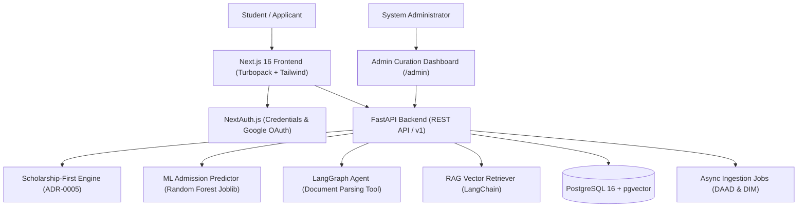

# AUSA — AI-Powered University & Scholarship Advisor

[](https://github.com/Ali0lo/AUSA/actions/workflows/ci.yml)
[](https://fastapi.tiangolo.com)
[](https://nextjs.org)
[](https://github.com/pgvector/pgvector)
[](https://www.docker.com)

---

## 📌 Project Overview

**AUSA (AI University & Scholarship Advisor)** is an intelligent advisory and university matching platform created as a **Holberton School Final Project**. It specifically bridges Azerbaijani students with top international (Germany, US, Turkey) and local Azerbaijani higher education institutions (ADA University, UNEC, Baku Higher Oil School, Baku State University).

By combining deterministic decision-tree logic, predictive machine learning models, vector retrieval (RAG), stateful LangGraph agents, and automated data pipelines, AUSA provides a transparent, scholarship-first matching engine for prospective university applicants.

---

## ✨ Key Features

- 🎓 **Scholarship-First Net-Cost Evaluation ([ADR-0005](docs/adr/0005-scholarship-first-net-cost-evaluation.md))**: Evaluates eligible institutional and state scholarships *before* applying hard budget filters, ensuring low-income students are not falsely excluded from high-tuition target programs.
- 📈 **Predictive Cutoff ML Inference ([ADR-0001](docs/adr/0001-ml-predictive-cutoff-layer.md) & [ADR-0002](docs/adr/0002-data-science-training-pipeline.md))**: In-memory Random Forest models trained on historical admission data predict admission cutoff scores and success probabilities for Turkey (YKS) and USA (SAT/GPA).
- 📄 **Autonomous Document Parsing (LangGraph Agent)**: Students can attach PDF transcripts or IELTS certificates directly in the chat interface. The application agent parses metrics (GPA, IELTS/TOEFL scores) via structured LLM output and automatically updates the student's database profile.
- 🌐 **Asynchronous Data Collection Pipelines**: Custom `asyncio` scrapers ingest program directories from DAAD/Uni-Assist and local Azerbaijani universities, extracting Studienkolleg, TestDaF language levels, €11,208 blocked account visa requirements, and DIM/TQDK entrance exam score scales (0–700 points).
- 🛠️ **Human-in-the-Loop Admin Dashboard**: Scraping records with confidence scores below 85% are automatically assigned `verification_status="flagged_for_review"`. Administrators inspect, edit, and approve flagged data before publication to the student matching engine.

---

## 🛠️ Architecture & Tech Stack



### Stack Components
- **Frontend**: Next.js 16 (App Router, Turbopack), TypeScript, Tailwind CSS, Lucide React, NextAuth.js.
- **Backend Framework**: FastAPI, Pydantic v2, Python 3.11+, Uvicorn.
- **Database & Storage**: PostgreSQL 16 with `pgvector` extension, Async SQLAlchemy 2.0, `asyncpg` driver.
- **Database Migrations**: Alembic (Async migration environment).
- **Machine Learning & AI**: Scikit-Learn (Random Forest), Joblib, LangChain, LangGraph, OpenAI GPT-4o-mini.
- **Data Ingestion**: `httpx`, `BeautifulSoup4`, `asyncio.gather`.
- **DevOps & Infrastructure**: Docker, Docker Compose, GitHub Actions CI/CD.

---

## 🚀 Quick Start (Local Production Environment)

Deploy the entire stack (FastAPI backend + PostgreSQL 16 pgvector database) locally in **3 steps**:

### Step 1: Clone Repository & Create Environment Files
```bash
git clone https://github.com/Ali0lo/AUSA.git
cd AUSA

# Copy environment variable templates
cp backend/.env.example backend/.env
cp frontend/.env.example frontend/.env.local
```

### Step 2: Spin Up Backend Services with Docker Compose
```bash
docker-compose -f docker-compose.prod.yml up -d --build
```
> The FastAPI backend will be available at `http://localhost:8000/api/v1` and database at `localhost:5432`.

### Step 3: Launch Next.js Frontend Development Server
```bash
cd frontend
npm install
npm run dev
```
> Open `http://localhost:3000` in your web browser.

---

## 🧪 Testing & Code Verification

Run backend unit test suites (Matching engine, Net-cost, ML predictors, Data pipelines, Admin endpoints):
```bash
PYTHONPATH=backend ./backend/.venv/bin/python -m pytest backend/tests/
```

Run frontend type checking & production build verification:
```bash
cd frontend
npm run build
```

---

## 💻 Key Technical Engineering Accomplishments (Ali Iskandarli)

- **Scholarship-First Net-Cost Matching Architecture ([ADR-0005](docs/adr/0005-scholarship-first-net-cost-evaluation.md))**: Designed and implemented the evaluation algorithm that calculates eligible institutional & state scholarships prior to executing hard budget filters.
- **Predictive Machine Learning Admission Models ([ADR-0001](docs/adr/0001-ml-predictive-cutoff-layer.md) & [ADR-0002](docs/adr/0002-data-science-training-pipeline.md))**: Developed and serialized Random Forest classifier pipelines to infer admission probability for Turkey (YKS) and US (SAT/GPA) programs, integrating them into FastAPI via an in-memory singleton predictor service.
- **Autonomous PDF Transcript Parsing & Agent Workflows**: Built stateful LangGraph agent tools and FastAPI file upload endpoints capable of extracting structured academic metrics (GPA, IELTS, TOEFL) from raw transcript PDFs to update student database profiles in real time.
- **Async Cross-Border Data Pipelines**: Created asynchronous scraping routines (`httpx` + `BeautifulSoup4`) for Germany (DAAD/Uni-Assist) and local Azerbaijani universities (ADA, UNEC, BANM, BSU) mapping TestDaF, Studienkolleg, €11,208 blocked accounts, and DIM/TQDK 0–700 exam score scales.
- **Human-in-the-Loop Admin Verification Dashboard**: Built the `/admin` curation interface and FastAPI endpoints to flag low-confidence (<85%) scraped records for human review before publishing them to the student matching engine.
- **Asynchronous Database & Migration Stack**: Implemented PostgreSQL 16 `pgvector` schemas, Async SQLAlchemy 2.0 ORM models, and an async Alembic migration environment.
- **DevOps & Production Infrastructure**: Authored production Docker container builds, `docker-compose.prod.yml`, Vercel routing rules, NextAuth Google OAuth integration, and GitHub Actions CI/CD workflows.

---

*Licensed under the [MIT License](LICENSE).*
