# AUSA Architecture Overview & System Design Manual

> **AUSA (Admissions & University Advisory Platform)**  
> *A route-first, deterministic admissions guidance and qualification engine built for Azerbaijani and international students.*

---

## 1. Executive Architectural Principles

AUSA is built on the philosophy that university admissions guidance must be **empirically honest, legally compliant, and deterministic**. It deliberately rejects synthetic heuristics in favor of statutory regulations and verified requirements:

1. **Route-First Qualification (ADR-0008 Compliant):**  
   Studying abroad is governed by discrete legal routes (`OPEN`, `UNLOCKABLE`, `BLOCKED`). An applicant either meets a country's prerequisite threshold (e.g. 13-year schooling rule for Germany requiring Studienkolleg or 1 year of domestic higher education) or they do not.
2. **Strict Rejection of Synthetic Match Percentages (ADR-0001 & ADR-0008):**  
   We strictly forbid arbitrary weighted scoring formulas (such as `0.5*GPA + 0.3*IELTS + 0.2*Extracurriculars`) or uncalibrated `P(admit)` classifiers. Real admissions committees do not evaluate candidates via weighted sums; admission abroad is decided by discrete gates, portfolio review, and immigration qualification.
3. **Pure Domain-Driven Isolation:**  
   Every domain engine is implemented as a standalone, framework-agnostic Python module under `backend/app/domain/` with zero HTTP or ORM dependencies. FastAPI routes (`backend/app/api/v1/`) act purely as thin serialization and validation layers over domain services.
4. **Statutory & Regulatory Rigor:**  
   All immigration calculations derive directly from official legal sources:
   - **Germany:** § 16b AufenthG & Auswärtiges Amt (€11,904/yr Sperrkonto).
   - **United Kingdom:** UKVI Appendix Student (£1,334/mo Inner London vs £1,023/mo Outer London with 28-day holding rule).
   - **United States:** 8 CFR 214.2(f)(1)(i)(B) (I-20 liquid funding requirement).
   - **Italy:** D.P.C.M. 159/2013 & D.Lgs. 68/2012 (ISEE Parificato threshold €25,000 for full DSU regional fee waivers).

---

## 2. System Architecture Diagram

```mermaid
flowchart TD
    subgraph Frontend["Frontend (Next.js 16 + React 19 + Tailwind CSS)"]
        UI_Home["/ Home & Overview"]
        UI_Plan["/plan Route Planner"]
        UI_Target["/target Target University & Gap Analysis"]
        UI_Dash["/dashboard Application Tracker & Comparison"]
        UI_Fin["/finance Visa & Sperrkonto Simulator"]
        UI_Sch["/scholarships Global Funding Explorer"]
        UI_Dim["/dim-calculator 700-Point Score Recommender"]
        UI_Sop["/sop-checker SOP & Academic CV Auditor"]
        UI_Time["/timeline 2026/27 Admissions Calendar"]
    end

    subgraph API["FastAPI Transport Layer (backend/app/api/v1/)"]
        API_Routes["/routes & /target"]
        API_Apps["/applications (compare, checklist, classify-tier)"]
        API_Fin["/finance (blocked accounts, FX conversion)"]
        API_Sch["/scholarships (gates evaluation)"]
        API_Dim["/dim (score breakdowns, cutoffs)"]
        API_Sop["/sop (rubric analysis, passive voice)"]
        API_Time["/timeline (milestones, .ics export)"]
    end

    subgraph Domain["Pure Domain Engines (backend/app/domain/)"]
        DE_Route["Route Engine (OPEN / UNLOCKABLE / BLOCKED)"]
        DE_App["Application Tracker (application_tracker.py)"]
        DE_Fin["Financial Calculator (financial_calculator.py)"]
        DE_Sch["Global Scholarships (global_scholarships.py)"]
        DE_Dim["DİM Score Engine (dim_calculator.py)"]
        DE_Sop["SOP & CV Auditor (sop_analyzer.py)"]
        DE_Time["Admissions Timeline (timeline.py)"]
    end

    subgraph CLI["AUSA Developer & Admissions CLI (bin/ausa)"]
        CLI_Core["Unified Argparse CLI (ausa_cli.py)"]
    end

    subgraph Data["Curated Databases & Legal Baselines"]
        DB_Cutoff["2,578 DİM Cutoff Records (2023-2025)"]
        DB_SP["4,121 State Programme Universities"]
        DB_Curated["50+ Top Comparison University Profiles"]
        DB_CBAR["CBAR Official FX Exchange Rates"]
    end

    Frontend --> API
    CLI_Core --> Domain
    API --> Domain
    Domain --> Data
```

---

## 3. Core Domain Subsystems

### 3.1 Financial & Blocked Account Simulator (`financial_calculator.py`)
- Simulates statutory living costs, blocked deposits, tuition, and multi-currency conversions against the Central Bank of Azerbaijan (CBAR) reference rates.
- Implements official statutory thresholds for German Sperrkonto, UK CAS maintenance funds with 28-day bank rules, US I-20 Cost of Attendance, and Italian ISEE-U family equivalency scales.

### 3.2 Global Scholarship Engine (`global_scholarships.py`)
- Evaluates eligibility across 14 premier international and bilateral scholarship programs (e.g. Türkiye Bursları, Chevening, Stipendium Hungaricum, Italian DSU/ER.GO, French Eiffel, Polish NAWA Banach, Fulbright, and BHOS 650+ State Scholarship).
- Uses discrete qualification gates (`OPEN`, `UNLOCKABLE`, `BLOCKED`) with actionable remediation steps for missing criteria.

### 3.3 DİM Entrance Exam Calculator & Recommender (`dim_calculator.py`)
- Computes scaled scores across Azerbaijani entrance examination Groups 1–4 from raw question breakdowns (Buraxılış and Blok open/closed questions).
- Matches candidates against 2,578 historical DİM cutoff records from 2023–2025, categorizing admission chance into `SAFE`, `REALISTIC`, `TARGET`, and `REACH`.
- Directly enforces the special Baku Higher Oil School (BANM) 650+ score threshold for 100% full state-funded scholarships.

### 3.4 Statement of Purpose & Academic CV Auditor (`sop_analyzer.py`)
- Rule-based natural language parser auditing applicant motivation letters and CVs.
- Evaluates 5 core narrative pillars (academic foundation, research intent, university fit, career trajectory, and State Programme repatriation/contribution).
- Flags clichés ("Ever since my childhood", "I have always been passionate"), detects excessive passive voice density, and validates structural headings.

### 3.5 Admissions Timeline & Milestone Tracker (`timeline.py`)
- Tracks over 20 critical admissions deadlines and intake windows for the 2026/2027 cycle across DE, GB, US, AZ, TR, IT, and HU.
- Computes real-time countdown days, dynamically assigns urgency status (`CRITICAL`, `UPCOMING`, `OPEN`), and generates RFC 5545 compliant `.ics` calendar files for Apple and Google Calendar import.

### 3.6 Student Application Dashboard & Comparison Workbench (`application_tracker.py`)
- Implements the complete application lifecycle: `DRAFT`, `DOCUMENT_GATHERING`, `SUBMITTED`, `INTERVIEW_SCHEDULED`, `OFFER_RECEIVED`, `REJECTED`, `VISA_PROCESSING`.
- Categorizes programs into `DREAM`, `TARGET`, and `SAFETY` tiers using verified QS rankings and GPA/language thresholds.
- Dynamic prerequisite document checklist generator for all study destinations with ASAN Xidmət, consular legalization, apostille, and translation instructions.
- Side-by-side comparison matrix evaluating tuition, living costs, blocked deposits, and post-study work rights (e.g. US 36-month STEM OPT vs Germany 18-month Job Seeker Visa).

### 3.7 AUSA Developer & Admissions CLI (`backend/cli/ausa_cli.py`)
- Unified command-line interface executable via `./bin/ausa`.
- Supports 8 high-utility subcommands: `dim-calc`, `finance`, `scholarships`, `timeline`, `compare`, `checklist`, `sop-check`, and `convert`.
- Includes full `--json` serialization for automated scripting, CI/CD, and headless pipelines.

---

## 4. Test Suite & Verification Matrix

The codebase is protected by automated unit, integration, and contract tests:

| Test Suite | Framework | Total Tests | Status | Execution Time |
| :--- | :--- | :--- | :--- | :--- |
| **Backend Pytest** | pytest 9.1 + pytest-asyncio | **489 tests** | ✅ **100% Passing** | ~11.5s |
| **Frontend Vitest** | vitest 2.1 + React Testing Library | **124 tests** | ✅ **100% Passing** | ~5.4s |
| **Combined** | — | **613 tests** | ✅ **0 Failures** | **~17.0s** |

---

## 5. Architectural Quality Standards

1. **Zero Synthetic Black Boxes:**  
   Every recommendation provides verifiable citations to university requirements, embassy regulations, or official ministry guidelines.
2. **Type Safety & Schema Integrity:**  
   Frontend strictly uses TypeScript with zero `any` evasions on domain contracts. Backend models strictly utilize Pydantic v2 schemas and SQLAlchemy 2.0 type mappings.
3. **Accessibility & Design System:**  
   Midnight blue canvas (`#0c0d1b`) glassmorphic aesthetic with high-contrast electric sunset accents (`#FF7A00` to `#FF4500`), conforming to WCAG 2.1 AA accessibility standards.
